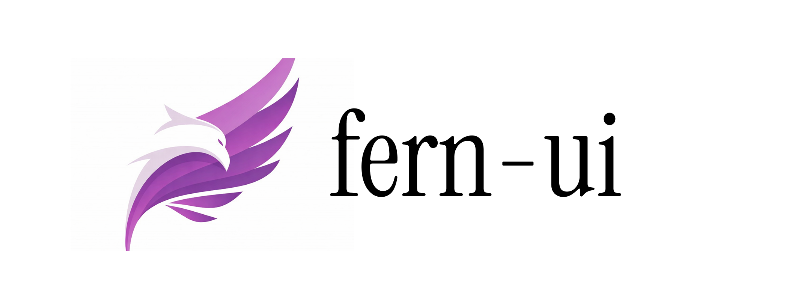

## Fern UI



Fern UI is a collection of polished, composable UI patterns and experiments built on top of Next.js and Tailwind CSS.

---

## Getting Started

Run the development server:

```bash
npm run dev
```

Then open `http://localhost:3000` in your browser to explore the components.

---

## How to Contribute

- **Explore existing patterns**: Browse the components under `components/` and their demos under `app/explore/` (for example, `components/shiny-wrap/` and `app/explore/shiny-wrap/`) to understand the structure and conventions.
- **Follow the conventions**: When adding a new component or example, mirror the folder structure, TypeScript props, Tailwind usage, and documentation style used by existing components.
- **Read the guide**: See `CONTRIBUTING.md` for detailed guidelines on how to add new components and explore pages in a way that stays consistent with the rest of Fern UI.

By keeping new contributions small, focused, and well-documented, we can grow Fern UI into a cohesive library of UI building blocks.
